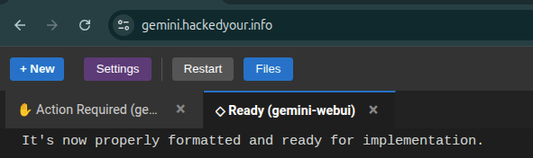
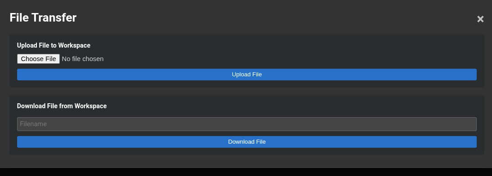
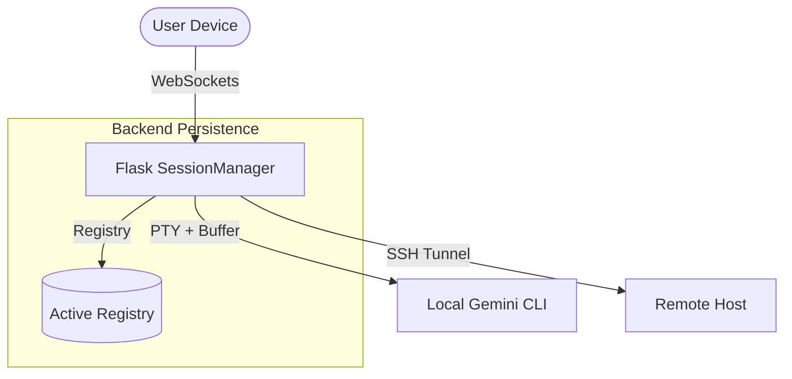
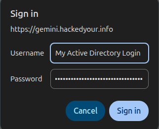

# Gemini WebUI

**The ultimate management interface for your Gemini AI, built for mobility and persistence.**



Gemini WebUI provides a high-fidelity, persistent web interface for the Gemini CLI. Whether you are monitoring complex projects, executing long-running AI tasks, or interacting with remote host machines, Gemini WebUI delivers a seamless experience across all your devices.

## 🚀 Key Features

*   **Multi-Environment Management**
    Manage multiple Gemini CLI instances across various computers, projects, and workspaces from a single, unified dashboard.
*   **Mobile-First Design**
    Experience a fully responsive UI equipped with mobile-friendly controls, enabling full Gemini CLI functionality on the go.
*   **Session Persistence**
    True cross-device persistence allows you to resume live sessions from your desktop directly on your phone or tablet without losing valuable context.
*   **Seamless File Management**
    Upload files directly through the UI via intuitive drag-and-drop or dedicated buttons, making your data immediately available to the AI.
    *   **Smart Bulk Uploads**: Dropping multiple files or a directory automatically groups them into a `upload-<timestamp>` folder, preserving their nested structure.
    *   **Terminal Auto-Injection**: File paths are automatically injected into your active terminal prompt (e.g., `> I uploaded @filename.txt` or `> I uploaded multiple files to @upload-1701234567/`) so the AI knows exactly where to look.
    
    

*   **Scoped Environments**
    Robust support for scoped development or per-app system administrator setups, ensuring secure and isolated AI environments tailored to your needs.
*   **Easy Deployment**
    Experience a frictionless quick start and simple installation process leveraging Docker and Docker Compose.

## 🏗 Architecture Overview

The system is designed with real-time communication and persistence at its core:



## 🛠 Configuration Guide

Gemini WebUI is highly customizable to fit both stand-alone and enterprise environments.

### Authentication Modes
1.  **LDAP (Enterprise)**: If `LDAP_SERVER` is configured, it becomes the exclusive authentication method, perfect for corporate networks.
2.  **Local Admin (Stand-alone)**: If LDAP is not configured, the application falls back to local authentication using `ADMIN_USER` and `ADMIN_PASS` (both default to `admin`).



### Environment Variables

| Variable | Description | Default |
| :--- | :--- | :--- |
| `LDAP_SERVER` | Address of the LDAP/AD server | - |
| `LDAP_BASE_DN` | Base DN for user searches | - |
| `LDAP_BIND_USER_DN` | Service account for LDAP lookups | - |
| `LDAP_BIND_PASS` | Password for the service account | - |
| `ADMIN_USER` | Local admin username | `admin` |
| `ADMIN_PASS` | Local admin password | `admin` |
| `ALLOWED_ORIGINS` | CORS whitelist (comma-separated) | `*` |
| `GEMINI_BIN` | Path to the Gemini executable | `gemini` |

### Volumes
*   `data:/data`: Persists application configuration, SSH keys, and CLI state (linked internally to `/home/node/.gemini`).

## 🚀 Quick Start & Easy Deployment

Deploying Gemini WebUI is designed to be as straightforward as possible. Build and launch the container with a single command:

```bash
docker compose up --build --force-recreate -d
```

Once the container is running, access the interface by navigating to `http://localhost:5000` in your web browser.
