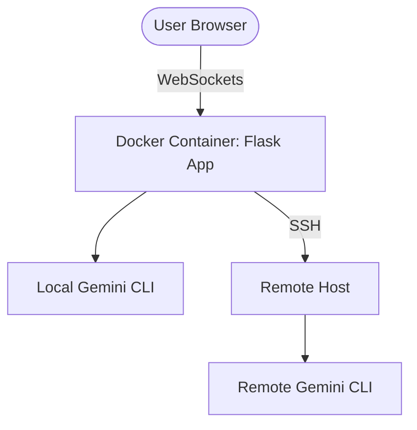

# Gemini WebUI

**The ultimate "Couch-Friendly" terminal for your Gemini AI.**

Gemini WebUI provides a high-fidelity, persistent web interface for the Gemini CLI. It allows you to monitor your projects, run long-running AI tasks, and interact with your host machine from any device with a browser—whether you're at your desk or relaxing on the couch with a tablet.

## 🚀 Benefits

*   **Monitor from Anywhere**: Keep an eye on long-running AI operations from your phone or tablet while away from your primary workstation.
*   **High-Fidelity Terminal**: Full 256-color and Truecolor support ensures that Gemini's rich UI components, progress bars, and box-drawing graphics look exactly as they should.
*   **Zero-Downtime Deployment**: Designed to stay up and running even during updates.
*   **Host Control**: Seamlessly switch between a local instance and an SSH session to manage remote servers directly.

---

## 🏗 Architecture



---

## 🧠 Expected Behaviors

### Navigating Away
If you close your browser tab or navigate away, **the backend process keeps running.** Your AI agent won't stop working just because you closed the window. When you return, simply ensure the **"Resume"** toggle is checked and click **"Restart"** to pick up exactly where you left off.

### Multi-Tab Synchronization
The WebUI supports "One Session, Many Views." If you open the interface in multiple tabs or on multiple devices:
*   **Mirroring**: Every tab will see the same output in real-time.
*   **Shared Input**: Keyboard input from any device is sent to the same session. 
This is perfect for starting a task on your PC and monitoring its progress from your phone.

---

## 🛠 Configuration

To run Gemini WebUI, you need to configure the following environment variables in your `docker-compose.yml`:

### Required Variables
*   `LDAP_BIND_USER_DN` & `LDAP_BIND_PASS`: Credentials for LDAP/Active Directory authentication.
*   `LDAP_AUTHORIZED_GROUP`: The LDAP group permitted to access the UI.

### Authentication
The WebUI supports two exclusive authentication modes:
1.  **LDAP (Enterprise)**: If `LDAP_SERVER` is configured, it is the **only** permitted authentication method. Local credentials are disabled.
2.  **Local Admin (Stand-alone)**: If LDAP is **not** configured, the app uses `ADMIN_USER` and `ADMIN_PASS` (both default to `admin`).

### Volumes
The application uses a named volume to persist configuration and AI state:
*   `data:/data`: Stores application configuration, SSH keys, and the Gemini CLI's persistent memory (linked internally to `/home/node/.gemini`).

---

## 🏗 Quick Start

Build and launch the container with a single command:

```bash
docker compose up --build --force-recreate -d
```

Once running, access the interface at `http://localhost:5000` (or your configured proxy domain).
